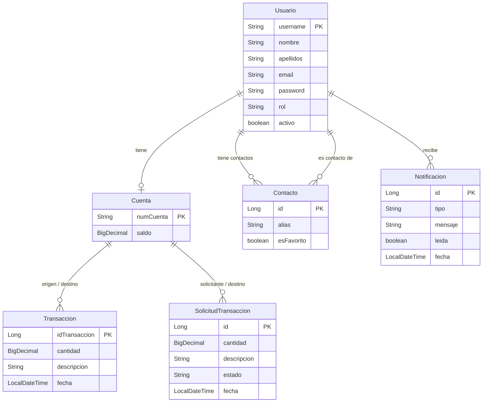

# 💻🌐 PROYECTO FINAL DAW 🌐💻

### 💡 IDEA DE LA APLICACIÓN 💡
**APIZum:** Sistema de pagos entre usuarios con autenticación mediante JWT.

### 🔧 FUNCIONALIDADES 🔧
- **Crear** usuarios, cuentas y transacciones.
- **Obtener** usuarios, cuentas y transacciones.
- **Actualizar** usuarios, cuentas.
- **Eliminar** usuarios (soft delete).
- Realizar transacciones entre cuentas con límite diario de 1.000 €.
- Gestión de contactos y favoritos.
- Solicitudes de pago entre usuarios.
- Notificaciones en tiempo real.
- Iniciar sesión con JWT (RS256).

### 💾 TABLAS DE LA BASE DE DATOS 💾
**Usuarios**, **Cuentas**, **Transacciones**, **Contactos**, **SolicitudesTransaccion**, **Notificaciones**.

---

## 👀 REGLAS DE ACCESIBILIDAD 👂

Estándar de accesibilidad: **WCAG 2.2 AA**.  
Reglas aplicadas para nuestro sitio web:

- **PERCEPTIBLES**:
    - El contenido no textual tiene una alternativa textual.
        - Imágenes.
    - La información, estructura y relaciones comunicadas a través de la presentación pueden ser determinadas por software o están disponibles como texto.
        - Los campos de formularios obligatorios están marcados con el texto *Obligatorio* de color rojo.
    - A excepción de los subtítulos y las imágenes de texto, todo el texto puede ser ajustado sin ayudas técnicas hasta un 200 por ciento sin que se pierdan el contenido o la funcionalidad.
        - Diseño responsive y texto con tamaño dinámico.
    - La presentación visual de los elementos tiene una ratio de contraste de la menos 3:1 con los colores adyacentes.
        - Colores elegidos con contraste superior.
- **OPERABLE**:
    - El propósito de cada enlace puede ser determinado con sólo el texto del enlace o a través del texto del enlace sumado al contexto del enlace determinado por software, excepto cuando el propósito del enlace resultara ambiguo para los usuarios en general.
        - Enlaces con un texto que describe la información de una URI.
    - Los encabezados y etiquetas describen el tema o propósito.
- **COMPRENSIBLE**:
    - El idioma predeterminado de cada página web puede ser determinado por software.
        - `html lang="es"`
    - Si se detecta automáticamente un error en la entrada de datos, el elemento erróneo es identificado y el error se describe al usuario mediante un texto.
        - Identificación de errores en un formulario.
    - Se proporcionan etiquetas o instrucciones cuando el contenido requiere la introducción de datos por parte del usuario.
        - Un campo en el cual el usuario debe ingresar su nombre dice claramente 'Nombre' y el campo donde se ingresa el apellido está etiquetado como 'Apellido', para evitar cualquier tipo de confusión acerca de qué nombre es el requerido.
- **ROBUSTO**:
    - En los contenidos implementados mediante el uso de lenguajes de marcas, los elementos tienen las etiquetas de apertura y cierre completas; los elementos están anidados de acuerdo a sus especificaciones; los elementos no contienen atributos duplicados y los ID son únicos, excepto cuando las especificaciones permitan estas características.
    - Para todos los componentes de la interfaz de usuario el nombre y la función pueden ser determinados por software; los estados, propiedades y valores que pueden ser asignados por el usuario pueden ser especificados por software; y los cambios en estos elementos se encuentran disponibles para su consulta por las aplicaciones de usuario, incluyendo las ayudas técnicas.
        - API accesible (pública).
    - En el contenido implementado en lenguajes de marcado, los mensajes de estado pueden ser determinados por software a través de su rol o propiedades, de tal modo que puedan ser presentados al usuario de productos de apoyo sin recibir el foco.
        - Mensajes de estado HTTP.

## 🚻 REGLAS DE USABILIDAD 🚻
- **Similitud del sistema con el mundo real**: El sistema debe ser muy simple y no convertir la interacción con él en un rompecabezas.
- **Estándares**: Usar un diseño familiar para el usuario.
- **Prevención de errores**: Advertir al usuario sobre la posibilidad de error.
- **Reconocimiento**: Las interacciones deben tener lugar en un nivel intuitivo, usando signos e iconografía familiar para el usuario u otros elementos reconocibles.
- **Simplicidad**: Cuanto más simple sea el sitio, visual y funcionalmente, más rápido logrará el usuario su objetivo en él.

## ✒️ PRINCIPIOS UX ✒️
- **Ley de Hick**: El tiempo que se tarda en tomar una decisión aumenta a medida que se incrementa el número de alternativas.
    - No sobrecargar al usuario con opciones.
- **Ley de Fitt**: El tiempo que necesita un usuario para señalar un objetivo en función del tamaño y la distancia.
    - Crear objetivos más grandes y minimizar movimientos.
- **Ley de Jakob**: Los usuarios prefieren que su sitio funcione de la misma manera que todos los otros sitios que ya conocen.
    - Respetar los patrones ya establecidos en objetos comunes.
- **Ley de Proximidad**: Los objetos cercanos o próximos entre sí tienden a agruparse.
    - Agrupar objetos por contexto.
- **Ley de Pregnancia**: La gente percibirá e interpretará imágenes ambiguas o complejas como la forma más simple posible.
    - Interpretación sencilla de imágenes.
- **Ley de Similitud o Semejanza**: Los elementos que comparten forma, color y tamaño se perciben como similares o iguales.
    - Respetar la relación diseño-funcionalidad de los objetos.

## 🔍 ENFOQUE AL SEO 🔎
- **Diseño Responsive (Mobile-First)**: La web debe adaptarse perfectamente a móviles, ya que la mayoría del tráfico proviene de estos dispositivos.
- **Arquitectura de la Información**: Crear una estructura clara y jerárquica.
- **Etiquetas de Encabezado**: Usar los encabezados para estructurar el contenido de manera lógica, utilizando solo un H1 por página.
- **URLs Amigables**: Diseñar URLs descriptivas, cortas y sin caracteres especiales.
- **Optimización de Imágenes**: Comprimir imágenes y usar etiquetas ALT descriptivas para mejorar la accesibilidad.
- **Accesibilidad y UX**: Diseñar para que los usuarios encuentren la información fácilmente.

---

## 🆔 TABLAS DE LA BASE DE DATOS 🆔

### 👨 Usuarios 👨
| CAMPO       | TIPO    | RESTRICCIONES                                        |
|:-----------:|:-------:|:-----------------------------------------------------|
| `username`  | VARCHAR | `PRIMARY KEY`, longitud: 9 numérico                  |
| `nombre`    | VARCHAR | `NOT NULL`                                           |
| `apellidos` | VARCHAR | -                                                    |
| `email`     | VARCHAR | `NOT NULL`, `UNIQUE`, contener @ y terminar .com/.es |
| `password`  | VARCHAR | `NOT NULL`, bcrypt                                   |
| `rol`       | VARCHAR | Valores: `ADMIN` / `USER`                            |
| `activo`    | BOOLEAN | Soft delete — `false` = eliminado                    |

### 💳 Cuentas 💳
| CAMPO       | TIPO    | RESTRICCIONES                          |
|:-----------:|:-------:|:---------------------------------------|
| `numCuenta` | VARCHAR | `PRIMARY KEY`, IBAN español (ES + 22)  |
| `saldo`     | DECIMAL | `NOT NULL`, igual o mayor a 0          |
| `username`  | VARCHAR | `FOREIGN KEY`                          |

### 📨 Transacciones 📨
| CAMPO           | TIPO     | RESTRICCIONES                      |
|:---------------:|:--------:|:-----------------------------------|
| `idTransaccion` | NUMBER   | `PRIMARY KEY`, Autoincremento      |
| `cantidad`      | DECIMAL  | `NOT NULL`, mayor a 0, ≤ saldo     |
| `descripcion`   | TEXT     | -                                  |
| `fecha`         | DATETIME | `NOT NULL`, fecha actual           |
| `cuentaOrigen`  | VARCHAR  | `FOREIGN KEY`                      |
| `cuentaDestino` | VARCHAR  | `FOREIGN KEY`                      |

### 👥 Contactos 👥 (N:M entre usuarios)
| CAMPO           | TIPO    | RESTRICCIONES                            |
|:---------------:|:-------:|:-----------------------------------------|
| `id`            | NUMBER  | `PRIMARY KEY`, Autoincremento            |
| `usuario`       | VARCHAR | `FOREIGN KEY` → Usuario (propietario)    |
| `contacto`      | VARCHAR | `FOREIGN KEY` → Usuario (contacto)       |
| `alias`         | VARCHAR | Apodo opcional                           |
| `esFavorito`    | BOOLEAN | Marca de favorito                        |

### 📋 Solicitudes 📋
| CAMPO              | TIPO     | RESTRICCIONES                                       |
|:------------------:|:--------:|:----------------------------------------------------|
| `id`               | NUMBER   | `PRIMARY KEY`, Autoincremento                       |
| `cuentaSolicitante`| VARCHAR  | `FOREIGN KEY`                                       |
| `cuentaDestino`    | VARCHAR  | `FOREIGN KEY`                                       |
| `cantidad`         | DECIMAL  | `NOT NULL`, mayor a 0                               |
| `descripcion`      | TEXT     | -                                                   |
| `estado`           | VARCHAR  | `PENDIENTE` / `ACEPTADA` / `RECHAZADA` / `CANCELADA`|
| `fecha`            | DATETIME | `NOT NULL`, fecha actual                            |

### 🔔 Notificaciones 🔔
| CAMPO         | TIPO     | RESTRICCIONES             |
|:-------------:|:--------:|:--------------------------|
| `id`          | NUMBER   | `PRIMARY KEY`             |
| `usuario`     | VARCHAR  | `FOREIGN KEY`             |
| `tipo`        | VARCHAR  | Tipo de evento            |
| `mensaje`     | TEXT     | Texto de la notificación  |
| `leida`       | BOOLEAN  | Estado de lectura         |
| `fecha`       | DATETIME | Fecha de creación         |

## 📑 DIAGRAMA ENTIDAD-RELACIÓN 📑



---

## 🔗 ENDPOINTS 🔗

### 🔒 Auth (público)
| MÉTODO | ENDPOINT                | DESCRIPCIÓN                                    |
|:------:|:------------------------|:-----------------------------------------------|
| POST   | `/auth/login`           | Inicio de sesión — devuelve JWT                |
| POST   | `/auth/registro`        | Paso 1: crear usuario — devuelve JWT temporal  |
| POST   | `/auth/registro/cuenta` | Paso 2: asociar IBAN (requiere JWT del paso 1) |

### 👨 UsuarioController
| MÉTODO | ENDPOINT               | DESCRIPCIÓN                      | ACCESO |
|:------:|:-----------------------|:---------------------------------|:------:|
| GET    | `/usuarios/`           | Perfil propio                    | USER   |
| PUT    | `/usuarios/`           | Actualizar perfil                | USER   |
| GET    | `/usuarios/buscar`     | Buscar usuario por email         | USER   |
| GET    | `/usuarios`            | Listar usuarios (paginado)       | ADMIN  |
| GET    | `/usuarios/{username}` | Ver usuario                      | ADMIN  |
| PUT    | `/usuarios/{username}` | Actualizar usuario               | ADMIN  |
| DELETE | `/usuarios/{username}` | Soft delete                      | ADMIN  |

### 💳 CuentaController
| MÉTODO | ENDPOINT               | DESCRIPCIÓN               | ACCESO |
|:------:|:-----------------------|:--------------------------|:------:|
| GET    | `/cuentas/`            | Ver cuenta propia         | USER   |
| GET    | `/cuentas/{numCuenta}` | Ver cualquier cuenta      | ADMIN  |
| PUT    | `/cuentas/{numCuenta}` | Editar saldo              | ADMIN  |

### 📨 TransaccionController
| MÉTODO | ENDPOINT                       | DESCRIPCIÓN                          | ACCESO |
|:------:|:-------------------------------|:-------------------------------------|:------:|
| POST   | `/transacciones/`              | Crear transferencia (límite 1.000€/día) | USER |
| GET    | `/transacciones/`              | Historial propio (paginado)          | USER   |
| GET    | `/transacciones/usuario/{u}`   | Historial por usuario                | ADMIN  |
| GET    | `/transacciones/cuenta/{n}`    | Historial por cuenta                 | ADMIN  |
| GET    | `/transacciones/{id}`          | Detalle de transacción               | ADMIN  |

### 👥 ContactoController
| MÉTODO | ENDPOINT                    | DESCRIPCIÓN           | ACCESO |
|:------:|:----------------------------|:----------------------|:------:|
| GET    | `/contactos`                | Listar contactos      | USER   |
| GET    | `/contactos/favoritos`      | Listar favoritos      | USER   |
| POST   | `/contactos`                | Añadir contacto       | USER   |
| PUT    | `/contactos/{id}/favorito`  | Toggle favorito       | USER   |
| DELETE | `/contactos/{id}`           | Eliminar contacto     | USER   |

### 📋 SolicitudController
| MÉTODO | ENDPOINT                        | DESCRIPCIÓN                | ACCESO |
|:------:|:--------------------------------|:---------------------------|:------:|
| GET    | `/solicitudes`                  | Mis solicitudes enviadas   | USER   |
| GET    | `/solicitudes/pendientes`       | Solicitudes recibidas      | USER   |
| POST   | `/solicitudes`                  | Crear solicitud            | USER   |
| PUT    | `/solicitudes/{id}/responder`   | Aceptar o rechazar         | USER   |
| PUT    | `/solicitudes/{id}/cancelar`    | Cancelar                   | USER   |

### 🔔 NotificacionController
| MÉTODO | ENDPOINT                        | DESCRIPCIÓN                | ACCESO |
|:------:|:--------------------------------|:---------------------------|:------:|
| GET    | `/notificaciones`               | Listar (paginado)          | USER   |
| GET    | `/notificaciones/no-leidas`     | Contar no leídas           | USER   |
| PUT    | `/notificaciones/leer-todas`    | Marcar todas como leídas   | USER   |

---

## 🧠 LÓGICA DE NEGOCIO 🧠

### 👨 Usuarios
- `username` es la **clave primaria** y debe contar con una **longitud: 9** caracteres numéricos.
- `nombre` **no puede ser nulo**.
- `email` **no puede ser nulo**, debe ser **único**, contener **@** y terminar en **.com/es**.
- `password` **no puede ser nulo** y quedará hasheada (bcrypt) en la base de datos.
- `rol` solo puede contener dos valores: `USER` o `ADMIN` (el rol por defecto será `USER`).
- Un `USER` puede **ver** y **actualizar** su perfil.
- Un `ADMIN` puede **ver**, **actualizar** y **eliminar** (soft delete) a los **usuarios**.
- Cualquiera puede **registrarse** e **iniciar sesión**.
- El **soft delete** desactiva el usuario (`activo = false`) sin borrar su historial financiero.

### 💳 Cuentas
- `numCuenta` es la **clave primaria** y debe ser un IBAN español válido (ISO 13616, mod 97).
- `saldo` **no puede ser nulo** y tiene que ser igual o mayor que 0.
- Un `USER` solo puede **ver** su cuenta. El saldo solo cambia mediante transacciones.
- Un `ADMIN` puede **ver** y **editar** cualquier cuenta.
- Las cuentas solo pueden ser creadas en el proceso de registro (paso 2).

### 📨 Transacciones
- `cantidad` **no puede ser nula**, debe ser **mayor a 0**, no puede superar el saldo actual y no puede superar el **límite diario de 1.000 €**.
- No se puede transferir a la misma cuenta de origen.
- Se aplica **bloqueo pesimista** (`PESSIMISTIC_WRITE`) para evitar condiciones de carrera en concurrencia.
- Al realizar una transferencia se generan **notificaciones** para el emisor y el receptor.

### 🔒 Restricciones de seguridad
- Cualquier acción excepto login y registro (paso 1) requiere un usuario autenticado con JWT.
- El endpoint `/auth/registro/cuenta` (paso 2) requiere el JWT emitido en el paso 1, no es público.
- Los usuarios **no pueden modificar su propio saldo** directamente.

⚠️ Uso de Spring Security con cifrado asimétrico RS256 (clave pública/privada) para el control de acceso. ⚠️

---

## 🆗 CÓDIGOS HTTP

| CÓDIGO | NOMBRE                | USO                                                              |
|:------:|:---------------------:|:-----------------------------------------------------------------|
| `200`  | `OK`                  | Solicitud realizada correctamente.                               |
| `201`  | `Created`             | Recurso creado correctamente.                                    |
| `204`  | `No Content`          | Solicitud realizada, sin contenido en la respuesta.              |
| `400`  | `Bad Request`         | Solicitud no procesada por un error del cliente.                 |
| `401`  | `Unauthorized`        | Solicitud no realizada por falta de credenciales de autorización.|
| `403`  | `Forbidden`           | Solicitud denegada por lógica de la aplicación.                  |
| `404`  | `Not Found`           | No se puede encontrar el recurso solicitado.                     |
| `422`  | `Unprocessable Entity`| Regla de negocio incumplida (saldo insuficiente, límite…).       |
| `500`  | `Internal Server Error`| Un error en el servidor impidió cumplir con la solicitud.       |

---

## ⚙️ CONFIGURACIÓN Y DEPENDENCIAS ⚙️

- `application.properties`: Configuración de la conexión a la base de datos y las **claves RSA**.
- `build.gradle.kts`: Dependencias backend → **Spring Web**, **Spring Data JPA**, **Spring Security**, **OAuth2 Resource Server**, **springdoc-openapi**, **MySQL Driver**, **H2** (tests).

| Componente | Tecnología            | Puerto |
|:-----------|:----------------------|:------:|
| Backend    | Spring Boot 3 · Java 17 | 8081 |
| Frontend   | Vue 3 · Vite · Nginx  | 80 / 5173 |
| Base de datos | MySQL 8            | 3306   |

---

## 🚀 ARRANCAR EL PROYECTO

### Requisitos previos

| Herramienta | Versión mínima | Para qué |
|:------------|:---------------|:---------|
| Java (JDK)  | 17             | Compilar y ejecutar el backend |
| Node.js     | 20             | Build del frontend |
| pnpm        | 9              | Gestor de paquetes del frontend |
| MySQL       | 8              | Base de datos (solo dev sin Docker) |
| Docker      | 24+            | Contenedores |
| openssl     | cualquiera     | Generar claves RSA |

### 1 — Generar claves RSA (obligatorio antes del primer arranque)

Las claves RSA **no están en el repositorio**. Genéralas localmente:

```bash
bash generate-keys.sh
```

> ⚠️ Nunca subas `private.pem` al repositorio.

### 2 — Entorno de desarrollo (sin Docker)

```bash
# Base de datos
mysql -u root -e "CREATE DATABASE apizumbd CHARACTER SET utf8mb4;"

# Backend
cd APIZum/APIZum
./gradlew bootRun
# → http://localhost:8081
# → http://localhost:8081/swagger-ui.html

# Frontend (otra terminal)
cd APIZumCliente
pnpm install
pnpm dev
# → http://localhost:5173
```

### 3 — Entorno Docker (recomendado)

```bash
# Levantar todo el stack
docker compose up --build

# En segundo plano
docker compose up -d

# Ver logs
docker compose logs -f

# Parar (conserva datos)
docker compose down

# Parar y eliminar datos
docker compose down -v
```

La aplicación queda disponible en **http://localhost**.

### 4 — Tests

```bash
cd APIZum/APIZum
./gradlew test
# Informe en: build/reports/tests/test/index.html
```

Los tests usan **H2 en memoria** — no necesitan MySQL.

---

## 🐳 DOCKER

### Servicios (`docker-compose.yml`)

```
db        → MySQL 8          (red interna, volumen persistente)
backend   → Spring Boot JAR  (depende de db con healthcheck)
frontend  → Vue + Nginx      (puerto 80, proxy /api → backend:8081)
```

**Redes:** `apizum-net` (bridge) — todos los contenedores se comunican por nombre.  
**Volúmenes:** `mysql_data` — datos de MySQL persistentes en el host.

### Dockerfiles (build multietapa)

**Backend** (`APIZum/APIZum/Dockerfile`):
```
Etapa 1: gradle:8-jdk17       → ./gradlew bootJar
Etapa 2: eclipse-temurin:17-jre-alpine → ejecuta el JAR (~200 MB)
```

**Frontend** (`APIZumCliente/Dockerfile`):
```
Etapa 1: node:20-alpine        → pnpm install + pnpm run build
Etapa 2: nginx:alpine          → sirve /app/dist en el puerto 80
```

El argumento `VITE_API_URL` define la URL del backend en producción:
```bash
docker build --build-arg VITE_API_URL=https://apizum-production.up.railway.app \
  -t apizum-frontend .
```

### Nginx (`APIZumCliente/nginx.conf`)

```nginx
location /api/ {
    proxy_pass http://backend:8081/;   # proxy inverso al backend
}
location / {
    try_files $uri $uri/ /index.html;  # Vue Router history mode
}
```

### Comandos útiles

```bash
# Reconstruir solo el backend
docker compose build backend
docker compose up -d --no-deps backend

# Publicar imágenes en Docker Hub manualmente
docker build -t fmuncar/apizum-backend:latest ./APIZum/APIZum
docker push fmuncar/apizum-backend:latest

docker build --build-arg VITE_API_URL=https://apizum-production.up.railway.app \
  -t fmuncar/apizum-frontend:latest ./APIZumCliente
docker push fmuncar/apizum-frontend:latest

# Desplegar desde imágenes de Docker Hub (sin compilar)
docker compose -f docker-compose.prod.yml up -d

# Actualizar a la última versión
docker compose -f docker-compose.prod.yml pull
docker compose -f docker-compose.prod.yml up -d
```

---

## 🔄 INTEGRACIÓN CONTINUA (CI/CD)

El fichero `.github/workflows/ci.yml` define el pipeline de **GitHub Actions**.

### Cuándo se ejecuta

| Evento | Qué ocurre |
|:-------|:-----------|
| Push a `develop` | Tests del backend |
| Pull Request a `main` | Tests del backend |
| Push a `main` | Tests + build y push de imágenes a Docker Hub |

### Flujo completo

```
1. Push a develop
        ↓
2. GitHub Actions ejecuta los 7 tests unitarios (JUnit + H2)
        ↓
3. Si pasan → PR a main
        ↓
4. Merge a main → GitHub Actions publica en Docker Hub:
   • fmuncar/apizum-backend:latest  + :<sha>
   • fmuncar/apizum-frontend:latest + :<sha>
        ↓
5. Railway → Redeploy manual (o automático por webhook)
```

### Tests ejecutados en CI

1. Transferencia correcta (caso feliz)
2. Saldo insuficiente → `EntidadImprocesableException`
3. Cuenta destino no encontrada → `NoEncontradoException`
4. Límite diario superado → `EntidadImprocesableException`
5. Origen = destino → `PeticionIncorrectaException`
6. IBAN inválido → `PeticionIncorrectaException`
7. Importe ≤ 0 → `PeticionIncorrectaException`

### Secrets necesarios en GitHub

Settings → Secrets → Actions:

| Secret | Valor |
|:-------|:------|
| `DOCKERHUB_USERNAME` | `fmuncar` |
| `DOCKERHUB_TOKEN` | Token de acceso de Docker Hub |

---

## 🌐 DESPLIEGUE EN PRODUCCIÓN (Render)

**URLs públicas:**
- Frontend  → https://apizum-frontend.onrender.com
- Backend   → https://apizum.onrender.com
- Swagger UI → https://apizum.onrender.com/swagger-ui.html

> ℹ️ El plan gratuito de Render duerme los servicios tras 15 minutos de inactividad. La primera petición puede tardar ~30-60 segundos en responder mientras el servicio arranca.

### Servicios en Render

| Servicio | Fuente | Puerto |
|:---------|:-------|:------:|
| Backend  | GitHub → Dockerfile (`APIZum/APIZum`) | 8081 |
| Frontend | GitHub → Dockerfile (`APIZumCliente`) | 80 |
| Base de datos | Aiven MySQL (free tier) | 24368 |

### Variables de entorno en Render

**Backend:**
```
SPRING_DATASOURCE_URL      = jdbc:mysql://<host>:<puerto>/defaultdb?sslMode=REQUIRED
SPRING_DATASOURCE_USERNAME = avnadmin
SPRING_DATASOURCE_PASSWORD = <password de Aiven>
SPRING_JPA_HIBERNATE_DDL_AUTO = update
CORS_ALLOWED_ORIGINS       = https://apizum-frontend.onrender.com
SERVER_PORT                = 8081
```

**Frontend:**
```
VITE_API_URL = https://apizum.onrender.com
```

### Proceso de publicación

1. `git push origin main` → el CI pasa los tests y sube las imágenes a Docker Hub automáticamente.
2. Render detecta el push y redespliega ambos servicios automáticamente (Auto-Deploy activado).

---

## 🔬 PRUEBAS CON CURL

```bash
BASE=http://localhost:8081
# Para producción: BASE=https://apizum.onrender.com
```

```bash
# Verificar que el backend responde
curl -s -o /dev/null -w "%{http_code}" $BASE/usuarios/
# → 401 (activo pero sin token)

# Registrar usuario (paso 1) y obtener token temporal
TOKEN_TEMP=$(curl -s -X POST "$BASE/auth/registro" \
  -H "Content-Type: application/json" \
  -d '{"username":"123456789","nombre":"Ana","apellidos":"García","email":"ana@test.com","password":"pass1234"}' \
  | grep -o '"token":"[^"]*' | cut -d'"' -f4)

# Crear cuenta bancaria (paso 2)
curl -s -X POST "$BASE/auth/registro/cuenta" \
  -H "Authorization: Bearer $TOKEN_TEMP" \
  -H "Content-Type: application/json" \
  -d '{"numCuenta":"ES9121000418450200051332"}'

# Login y obtener token definitivo
TOKEN=$(curl -s -X POST "$BASE/auth/login" \
  -H "Content-Type: application/json" \
  -d '{"username":"123456789","password":"pass1234"}' \
  | grep -o '"token":"[^"]*' | cut -d'"' -f4)

# Ver perfil
curl -s "$BASE/usuarios/" -H "Authorization: Bearer $TOKEN"

# Crear transferencia
curl -s -X POST "$BASE/transacciones/" \
  -H "Authorization: Bearer $TOKEN" \
  -H "Content-Type: application/json" \
  -d '{"numCuentaDestino":"ES7620770024003102575766","cantidad":50.00,"descripcion":"Cena"}'

# Historial paginado
curl -s "$BASE/transacciones/?page=0&size=10&sort=fecha,desc" \
  -H "Authorization: Bearer $TOKEN"
```

---

## 🌿 FLUJO DE TRABAJO GIT

### Ramas

| Rama | Propósito |
|:-----|:----------|
| `main` | Código estable. Cada merge publica imágenes en Docker Hub. |
| `develop` | Integración de funcionalidades. |
| `feature/<nombre>` | Nueva funcionalidad. Se fusiona en `develop`. |
| `fix/<nombre>` | Corrección de errores. |
| `hotfix/<nombre>` | Parche urgente en producción. |

### Commits (Conventional Commits)

```
feat(transacciones): añadir límite diario de 1000€
fix(iban): corregir validación mod-97
test(transaccion-service): añadir caso límite diario
docs(readme): añadir sección CI/CD
```

---

## ❓ ERRORES FRECUENTES

**`FileNotFoundException: certs/private.pem`**  
→ Ejecutar `bash generate-keys.sh`

**`Communications link failure`**  
→ MySQL no está levantado. Ejecutar `docker compose up db -d`

**`"updateCuenta" is not exported`**  
→ Los usuarios no pueden editar el saldo directamente. Esa función fue eliminada por seguridad.

**`401` al llamar a `/auth/registro/cuenta`**  
→ El token del paso 1 no se está enviando en el header `Authorization: Bearer <token>`.

**Frontend muestra "Error al cargar" en producción**  
→ El backend de Render está dormido (plan gratuito). Esperar ~30-60 segundos y recargar.

**Error CORS en el navegador**  
→ Añadir el origen a `CORS_ALLOWED_ORIGINS` en las variables de entorno de Render.

**Contenedor con nombre ya en uso al hacer `docker compose up`**  
→ Ejecutar `docker rm -f apizum-db apizum-backend apizum-frontend` y volver a intentarlo.
