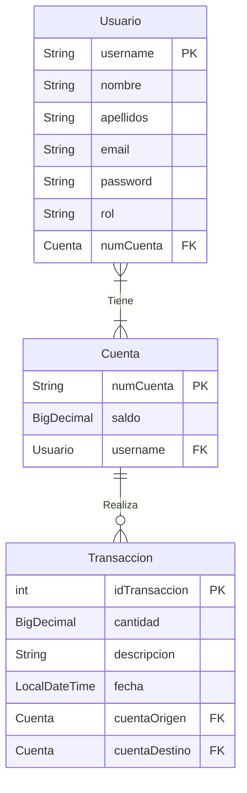

# 💻🌐 PROYECTO FINAL DAW 🌐💻

### 💡 IDEA DE LA APLICACIÓN 💡
**APIZum :** Sistema de pagos entre usuarios con autenticación mediante JWT.

### 🔧 FUNCIONALIDADES 🔧
- **Crear** usuarios, cuentas y transacciones.
- **Obtener** usuarios, cuentas y transacciones.
- **Actualizar** usuarios, cuentas.
- **Eliminar** usuarios.
- Realizar transacciones entre cuentas.
- Iniciar sesión con JWT.

### 💾 TABLAS DE LA BASE DE DATOS 💾 ###
**Usuarios**, **Cuentas** y **Transacciones**.

---

## 👀 REGLAS DE ACCESIBILIDAD 👂
Estándar de accesibilidad: **WCAG 2.2 AA**.  
Reglas aplicadas para nuestro sitio web:
- **PERCEPTIBLES**:
    - El contenido no textual tiene una alternativa textual.
        - Imágenes.
    - La información, estructura y relaciones comunicadas a través de la presentación pueden ser determinadas por software o están disponibles como texto.
        - Los campos de formularios obligatorios están marcados con el texto *Obligatorio* de color rojo.
    - A excepción de los subtítulos y las imágenes de texto, todo el texto puede ser ajustado sin ayudas técnicas hasta un 200 por ciento sin que se pierdan el contenido o la funcionalidad.
        - Diseño responsive y texto con tamaño dinámico.
    - La presentación visual de los elementos tiene una ratio de contraste de la menos 3:1 con los colores adyacentes.
        - Colores elegidos con contraste superior.
- **OPERABLE**:
    - El propósito de cada enlace puede ser determinado con sólo el texto del enlace o a través del texto del enlace sumado al contexto del enlace determinado por software, excepto cuando el propósito del enlace resultara ambiguo para los usuarios en general.
        - Enlaces con un texto que describe la información de una URI.
    - Los encabezados y etiquetas describen el tema o propósito.
- **COMPRENSIBLE**:
    - El idioma predeterminado de cada página web puede ser determinado por software.
        - `html lang="es"`
    - Si se detecta automáticamente un error en la entrada de datos, el elemento erróneo es identificado y el error se describe al usuario mediante un texto.
        - Identificación de errores en un formulario.
    - Se proporcionan etiquetas o instrucciones cuando el contenido requiere la introducción de datos por parte del usuario.
        - Un campo en el cual el usuario debe ingresar su nombre dice claramente 'Nombre' y el campo donde se ingresa el apellido está etiquetado como 'Apellido', para evitar cualquier tipo de confusión acerca de qué nombre es el requerido.
- **ROBUSTO**:
    - En los contenidos implementados mediante el uso de lenguajes de marcas, los elementos tienen las etiquetas de apertura y cierre completas; los elementos están anidados de acuerdo a sus especificaciones; los elementos no contienen atributos duplicados y los ID son únicos, excepto cuando las especificaciones permitan estas características.
    - Para todos los componentes de la interfaz de usuario el nombre y la función pueden ser determinados por software; los estados, propiedades y valores que pueden ser asignados por el usuario pueden ser especificados por software; y los cambios en estos elementos se encuentran disponibles para su consulta por las aplicaciones de usuario, incluyendo las ayudas técnicas.
        - API accesible (pública).
    - En el contenido implementado en lenguajes de marcado, los mensajes de estado pueden ser determinados por software a través de su rol o propiedades, de tal modo que puedan ser presentados al usuario de productos de apoyo sin recibir el foco.
        - Mensajes de estado HTTP.

## 🚻 REGLAS DE USABILIDAD 🚻
- **Similitud del sistema con el mundo real**: El sistema debe ser muy simple y no convertir la interacción con él en un rompecabezas.
- **Estándares**: Usar un diseño familiar para el usuario.
- **Prevención de errores**: Advertir al usuario sobre la posibilidad de error.
- **Reconocimiento**: Las interacciones deben tener lugar en un nivel intuitivo, usando signos e iconografía familiar para el usuario u otros elementos reconocibles.
- **Simplicidad**: Cuanto más simple sea el sitio, visual y funcionalmente, más rápido logrará el usuario su objetivo en él.

## ✒️ PRINCIPIOS UX ✒️
- **Ley de Hick**: El tiempo que se tarda en tomar una decisión aumenta a medida que se incrementa el número de alternativas.
    - No sobrecargar al usuario con opciones.
- **Ley de Fitt**: El tiempo que necesita un usuario para señalar un objetivo en función del tamaño y la distancia.
    -  Crear objetivos más grandes y minimizar movimientos
- **Ley de Jakob**: Los usuarios prefieren que su sitio funcione de la misma manera que todos los otros sitios que ya conocen.
    -  Respetar los patrones ya establecidos en objetos comunes.
- **Ley de Proximidad**: Los objetos cercanos o próximos entre sí tienden a agruparse.
    - Agrupar objetos por contexto.
- **Ley de Pregnancia**: La gente percibirá e interpretará imágenes ambiguas o complejas como la forma más simple posible.
    - Interpretación sencilla de imágenes.
- **Ley de Similitud o Semejanza**: Los elementos que comparten forma, color y tamaño se perciben como similares o iguales.
    - Respetar la relación diseño-funcionalidad de los objetos.

## 🔍 ENFOQUE AL SEO 🔎
- **Diseño Responsive (Mobile-First)**: La web debe adaptarse perfectamente a móviles, ya que la mayoría del tráfico proviene de estos dispositivos.
- **Arquitectura de la Información**: Crear una estructura clara y jerárquica.
- **Etiquetas de Encabezado**: Usar los encabezados para estructurar el contenido de manera lógica, utilizando solo un H1 por página.
- **URLs Amigables**: Diseñar URLs descriptivas, cortas y sin caracteres especiales.
- **Optimización de Imágenes**: Comprimir imágenes y usar etiquetas ALT descriptivas para mejorar la accesibilidad.
- **Accesibilidad y UX**: Diseñar para que los usuarios encuentren la información fácilmente.

---

## 🆔 TABLAS DE LA BASE DE DATOS 🆔
### 👨 Usuarios 👨
|    CAMPO        |   TIPO    | RESTRICCIONES                                        |
|:-----------:    | :-------: |:-----------------------------------------------------|
| `username`      |  VARCHAR  | `PRIMARY KEY`, longitud: 9 numérico                  |
|  `nombre`       | VARCHAR   | `NOT NULL`                                           |
| `apellidos`     |  VARCHAR  | -                                                    |
|  `email`        |  VARCHAR  | `NOT NULL`, `UNIQUE`, contener @ y terminar .com/.es |
| `password`      |  VARCHAR  | `NOT NULL`, longitud: 8-20  alfanumérico             |
|    `rol`        |  VARCHAR  | Valores: `ADMIN` / `USER`                            |
| `numCuenta`     |  VARCHAR  | `FOREIGN KEY`                                        |

### 💳 Cuentas 💳
|    CAMPO        |   TIPO    |   RESTRICCIONES                                      |
| :---------:     | :-------: | :--------------------------------------------------- |
| `numCuenta`     |  VARCHAR  | `PRIMARY KEY`, empieza por ES                        |
| `saldo`         |  DECIMAL  | `NOT NULL`, igual o mayor a 0                        |
| `username`      |  VARCHAR  | `FOREIGN KEY`                                        |

### 📨 Transacciones 📨
|    CAMPO        |   TIPO    |   RESTRICCIONES                                      |
| :---------:     | :-------: | :--------------------------------------------------- |
| `idTransaccion` |  NUMBER   | `PRIMARY KEY`, Autoincremento                        |
| `cantidad`      |  DECIMAL  | `NOT NULL`, mayor a 0                                |
| `descripcion`   |  TEXT     | -                                                    |
| `fecha`         |  DATETIME | `NOT NULL`, fecha actual                             |
| `cuentaOrigen`  |  NUMBER   | `FOREIGN KEY`                                        |
| `cuentaDestino` |  NUMBER   | `FOREIGN KEY`                                        |

## 📑 DIAGRAMA ENTIDAD-RELACIÓN 📑
+ **Usuario <- Tiene (1:1) ->  Cuenta**
+ **Cuenta <- Realiza (1:N) -> Transaccion**

---

## 🔗 ENDPOINTS 🔗
### 👨 UsuarioController 👨
|  MÉTODO  |  ENDPOINT                           |   DESCRIPCIÓN           | ACCESO  |
| :------: |:----------------------------------- |:----------------------- |:------: |
|  GET     | `/perfil`                           | Perfil propio           | USER    |
|  PUT     | `/perfil`                           | Actualizar perfil       | USER    |
|  GET     | `/admin/usuarios`                   | Ver usuarios            | ADMIN   |
|  GET     | `/admin/usuarios/{username}`        | Ver usuario             | ADMIN   |
|  PUT     | `/admin/usuarios/{username}`        | Actualizar usuario      | ADMIN   |
|  DELETE  | `/admin/usuarios/{username}`        | Eliminar usuario        | ADMIN   |

### 💳 CuentaController 💳
|  MÉTODO  |   ENDPOINT                          |   DESCRIPCIÓN           | ACCESO  |
| :------: | :---------------------------------- |:----------------------- |:------: |
|  GET     | `/cuenta`                           | Ver cuenta              | USER    |
|  PUT     | `/cuenta`                           | Actualizar cuenta       | USER    |
|  GET     | `/admin/cuentas/{numCuenta}`        | Ver cuenta              | ADMIN   |

### 📨 TransaccionController 📨
|  MÉTODO  |   ENDPOINT                          |   DESCRIPCIÓN           | ACCESO  |
| :------: | :----------------------------       |:----------------------- |:------: |
|  POST    | `/transacciones`                    | Crear transaccion       | USER    |
|  GET     | `/transacciones/nueva`              | Historial transacciones | USER    |
|  GET     | `/admin/transacciones/{numCuenta}`  | Historial transacciones | ADMIN   |
|  GET     | `/admin/transacciones/{id}`         | Ver transacción         | ADMIN   |

### 🔒 AuthController 🔒
|  MÉTODO  |   ENDPOINT                          |   DESCRIPCIÓN           | ACCESO  |
| :------: | :---------------------------------- |:----------------------- |:------: |
|  POST    | `/login`                            | Inicio de sesión        | Público |
|  POST    | `/registro`                         | Registrar usuario       | Público |
|  POST    | `/registro`                         | Alta cuenta             | Público |

## 🧠 LÓGICA DE NEGOCIO 🧠
### 👨 Usuarios 👨
- `username` es la **clave primaria** y debe contar con una **longitud: 9** caracteres numéricos.
- `nombre` **no puede ser nulo**.
- `email` **no puede ser nulo**, debe ser **único**, contener **@** y terminar en **.com/es**.
- `password` **no puede ser nulo**, debe tener una **longitud: 8-20** caracteres **alfanuméricos** y quedará hasheada en la base de datos.
- `repetirPassword` solo se usa en el registro y en actualizar usuario para verificar `password`. Deben coincidir exactamente y no se almacena en la base de datos.
- `rol` solo puede contener dos valores: `USER` o `ADMIN` (el rol por defecto será `USER`).
- `numCuenta` es la **clave foránea**.
- Un `USER` puede **ver** y **actualizar** su perfil.
- Un `ADMIN` puede **ver**, **actualizar** y **eliminar** a los **usuarios**.
- Cualquiera puede **registrarse** e **iniciar sesión**.
- Si un **usuario** es **eliminado**, también se elimina su **cuenta** (relación fuerte).

### 💳 Cuentas 💳
- `numCuenta` es la **clave primaria** y tiene que empezar por ES.
- `saldo` **no puede ser nulo** y tiene que ser igual o mayor que 0.
- `username` es la **clave foránea**.
- Un `USER` puede **ver** y **actualizar** su **cuenta**.
- Un `ADMIN` puede **ver** las **cuentas**.
- **Una cuenta** tiene que estar asociada a **un usuario**.
- Las cuentas solo pueden ser creadas en el proceso de registro de usuarios.
- Si una **cuenta** es **eliminada**, **NO se eliminan** sus **transacciones**.

### 📨 Transacciones 📨
- `idTransaccion` es la **clave primaria** y tiene autoincremento.
- `cantidad` **no puede ser nulo**, debe ser **mayor a 0** y **no puede superar al saldo actual**.
- `fecha` **no puede ser nula** y debe ser la actual.
- `cuentaOrigen` e `cuentaDestino` son las **claves foráneas**.
- Un `USER` puede **crear transacciones** y **ver el historial**.
- Un `ADMIN` puede **ver el historial** por cuenta o id de la transacción.

### 🔒 Restricciones de seguridad 🔓
- Cualquier acción con excepción de **Registrar usuario** e **Inicio de sesión** requiere un usuario autentificado.

⚠️ Uso de Spring Security con cifrado asimétrico por clave pública y privada con JWT para el control de acceso. ⚠️

## 🆗 CÓDIGOS HTTP ❌
|CÓDIGO|     NOMBRE            |       USO                                                        |
|:----:| :-------------------: | :--------------------------------------------------------------- |
|`200` |`OK`                   | Solicitud realizada correctamente.                               |
|`201` |`Created`              | Recurso creado correctamente.                                    |
|`204` |`No Content`           | Solicitud realizada, no es necesario salir de la página actual.  |
|`400` |`Bad Request`          | Solicitud no procesada por un error del cliente.                 |
|`401` |`Unauthorized`         | Solicitud no realizada por falta de credenciales de autorización.|
|`403` |`Forbidden`            | Solicitud denegada por lógica de la aplicación.                  |
|`404` |`Not Found`            | No se puede encontrar el recurso solicitado.                     |
|`422` |`Unprocessable Entity` | El servidor no pudo procesar las instrucciones de la solicitud.  |
|`500` |`Internal Server Error`| Un error en el servidor impidió cumplir con la solicitud.        |

---

## ⚙️ CONFIGURACIÓN Y DEPENDENCIAS ⚙️
- `application.properties` : Configuración de la conexión a la base de datos y las **claves RSA**.
- `build.gradle.kts`: Dependencias backend -> **Spring Web**, **Spring Data JPA**, **Spring Security**, **MySQL Driver**.
